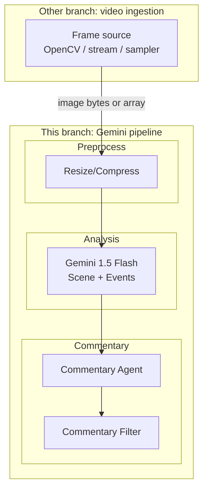

# AI Remy ??System Design & Implementation Outline

An AI cooking assistant that observes kitchen activity via ESP32-CAM and provides real-time, Remy-style commentary using Gemini and text-to-speech.

> **This branch:** Gemini implementation only (preprocess, scene analysis, events, commentary, filtering). **Video ingestion (OpenCV, stream capture, frame sampling) is implemented on another branch**; you will pass frames into this pipeline (e.g. as image bytes or numpy arrays) after merging or wiring the two branches.

---

## 1. System Architecture Diagram



**High-level data flow (full system after merge):**

```
[Other branch: OpenCV ? Sampler] --> [This branch: Preprocess ? Gemini ? Commentary ? Filter] --> [TTS / Playback]
```

---

## 2. Detailed Pipeline Description

| Stage | Input | Output | Notes |
|-------|--------|--------|--------|
| **1?2. Video ingestion & sampling** | *(Other branch)* | Frames every 3?5 s | OpenCV capture + sampler; not in this branch. |
| **3. Image preprocessing** | Raw frame (bytes/array) | Compressed/resized image | e.g. max 1024px, JPEG 80?85; Pillow or numpy. |
| **4. Scene analysis** | Image + prompt | Text: scene description + events | Single Gemini call: "Describe scene and list cooking actions." |
| **5. Event extraction** | Model text | Structured events (e.g. list of strings) | Regex or small parser; optional JSON in prompt. |
| **6. Agent commentary** | Events + personality prompt | Short commentary string | "Remy" tone: encouraging, observant, playful. |
| **7. Commentary filtering** | Commentary + recent history | Pass / drop | Drop if too similar to last N comments or empty. |
| **8?9. TTS & playback** | *(Optional in this branch)* | Audio from speakers | Piper/Coqui + pygame; add when integrating. |

**Latency budget (this branch):** Preprocess &lt;50 ms, Gemini 0.5?1.5 s. Ingestion and TTS add their own latency after merge.

---

## 3. Modular Software Architecture (this branch: Gemini only)

Python package layout for the **Gemini pipeline** (no OpenCV; frame input from the other branch):

```
ai_remy/
??? __init__.py
??? config.py              # API key, image size, quality (env)
??? pipeline.py            # process_frame(image) -> (events, commentary, should_speak)
??? vision/
?   ??? __init__.py
?   ??? preprocess.py      # Resize, compress (Pillow); image -> bytes for API
?   ??? gemini_client.py   # Send image + prompts, parse scene + events + commentary
??? reasoning/
?   ??? __init__.py
?   ??? events.py          # Event extraction from model text
?   ??? filter.py          # Dedupe, meaningful filter
??? state/
    ??? __init__.py
    ??? memory.py          # Recent events and commentaries for context + filtering
```

**Module roles:**

- **vision**: Preprocess (Pillow, no OpenCV) and Gemini API; prompts live here.
- **reasoning**: Parse events; filter commentary (avoid repeat, empty).
- **state**: Recent events and last N commentaries for context and filtering.

**Integration:** The other branch calls `process_frame(frame)` with a frame (numpy array or image bytes); this branch returns `(events, commentary, should_speak)` so the other branch can drive TTS when `should_speak` is True.

---

## 4. Suggested Python Libraries (this branch)

| Purpose | Library | Version / notes |
|---------|---------|------------------|
| Gemini API | `google-generativeai` | Official SDK; supports image + text |
| Image preprocessing | `Pillow` | Resize/compress without OpenCV; input can be bytes or array |
| Env & config | `python-dotenv` | API key, max image size, JPEG quality |
| Logging | stdlib `logging` | Debug and pipeline stages |

*Video capture (OpenCV), TTS, and playback are on the other branch or added when integrating.*

**requirements.txt (this branch):**

```text
google-generativeai>=0.3.0
Pillow>=10.0.0
python-dotenv>=1.0.0
```

---

## 5. Example: Using the Gemini Pipeline (this branch)

**Single entry point** ? call this from the other branch for each sampled frame:

```python
# pipeline.py ? entry point for a single frame (no OpenCV here)

from vision.preprocess import preprocess_frame
from vision.gemini_client import analyze_scene
from reasoning.events import extract_events
from reasoning.filter import should_speak
from state.memory import RecentMemory

def process_frame(image_input, memory: RecentMemory):
    """
    image_input: numpy array (H, W, 3) or bytes (JPEG/PNG).
    Returns: (events: list[str], commentary: str, should_speak: bool)
    """
    image_bytes = preprocess_frame(image_input, max_size=1024, quality=85)
    scene_text, events_text = analyze_scene(image_bytes, memory.get_context())
    events = extract_events(events_text)
    memory.add_events(events)
    commentary = ...  # from Gemini (combined or second call)
    if not should_speak(commentary, memory.get_recent_commentaries()):
        return (events, commentary, False)
    memory.add_commentary(commentary)
    return (events, commentary, True)
```

**On the other branch** (after merge), your loop would look like:

```python
from ai_remy.pipeline import process_frame
from ai_remy.state.memory import RecentMemory
# ... your OpenCV capture + sampler ...

memory = RecentMemory(max_events=10, max_commentaries=5)
while True:
    frame = your_capture.read_frame()  # from your branch
    if not your_sampler.should_process(frame):
        continue
    events, commentary, should_speak = process_frame(frame, memory)
    if should_speak:
        your_tts.speak(commentary)
```

---

## 6. Reducing API Usage

- **Sample frames every 3?? s:** Largest lever; e.g. 4 s ??~15 Gemini calls/min.
- **Single combined prompt:** One request for ?scene description + list of cooking actions??(and optionally ?one short comment?? instead of separate description and commentary calls.
- **Image size:** Resize to e.g. 1024 px max dimension, JPEG 80??5; fewer image tokens.
- **Skip when idle:** If the previous response was ?no significant activity,??skip or delay the next call (e.g. 8 s instead of 4 s).
- **Cache ?no change??** Compare current frame hash or simple feature to previous; if nearly identical, skip API call.
- **Rate limit commentary:** Only ask for commentary every 2nd or 3rd analysis (store last events and generate comment from them).
- **Use Gemini 1.5 Flash:** Cheaper and fast; sufficient for this use case.

---

## 7. Detecting Cooking Actions More Accurately

- **Structured prompt:** Ask for a fixed list of actions (e.g. chopping, stirring, heating oil, adding ingredients) and output format (e.g. JSON or one action per line) for reliable parsing.
- **Temporal context in prompt:** Send ?previous events??in the prompt so the model can infer ?now stirring after adding onions.??
- **Two-stage pipeline (optional):** First call: ?What objects and actions do you see???Second call (only when needed): ?Given these actions, give one Remy-style comment.??Reduces second calls.
- **Motion cue in prompt:** If you compute simple motion (e.g. frame diff magnitude), add to prompt: ?There has been significant motion in the last 5 seconds??to bias toward action-focused answers.
- **Lightweight local motion detection:** Use OpenCV (frame diff, contour area) to only send frames when motion exceeds a threshold; avoids sending static scenes to the API.

---

## 8. Detecting Cooking Mistakes

- **Explicit prompt instructions:** ?Note any potential mistakes: burning, smoking oil, overcrowded pan, raw meat near ready-to-eat food, unattended stove, knife safety.??
- **Structured output:** Request a ?safety_notes??or ?mistakes??field in the model response; parse and prioritize for commentary.
- **Tone for mistakes:** In the personality prompt: ?If you see a safety or quality issue, mention it in a friendly, constructive way (e.g. ?The oil might be getting too hot ??consider lowering the heat??.??
- **Smoke / burning:** Model can infer from visual description; optionally add a simple local detector (e.g. dominant color shift + ?smoke??in prompt) to trigger more frequent checks.
- **Rate limit mistake comments:** So the assistant doesn?t repeat the same warning every 4 s; use memory of ?last warning??and cooldown.

---

## 9. Improving User Experience

- **Voice:** Choose a warm, clear Piper/Coqui voice; slightly slower speed for clarity.
- **Short comments:** Cap commentary at ~15 words so it doesn?t overlap the next one.
- **Pause on user speech (optional):** Use a simple VAD or ?push-to-talk??so Remy stays quiet while the user is talking.
- **Visual feedback:** Small UI (e.g. Pygame or a web dashboard) showing ?Remy is watching??and last comment; builds trust.
- **Configurable personality:** Slider or config for ?more encouraging??vs ?more technical??so it fits different users.
- **Graceful degradation:** If the stream drops, say ?I lost the video for a moment??(pre-recorded or TTS) and reconnect; if API fails, retry once and then skip with a short message.
- **Startup sound:** Short ?I?m here??chime so the user knows the system is on.

---

## 10. Optional Advanced Features

### Tracking cooking progress over time

- **state/memory.py:** Append timestamps to events (e.g. `{"action": "chopping onion", "t": 0}`, `{"action": "adding onion to pan", "t": 120}`).
- **Prompt:** Periodically include ?So far you have: ???and ask ?What step likely comes next???or ?How is the recipe progressing???
- **Simple recipe skeleton:** Optional list of high-level steps (e.g. ?mise en place ??heat oil ??add aromatics ?????; match detected events to steps and say ?Great, you?re on step 2.??

### Recognizing ingredients

- **Prompt:** ?List visible ingredients (e.g. onion, garlic, tomato, oil) and their state (raw, chopped, in pan).??
- **Structured output:** e.g. `ingredients: [{name, state}]`; use for commentary (?Nice, you?ve got your aromatics ready?? and for progress.

### Detecting unsafe cooking actions

- **Prompt section:** ?Describe any safety concerns: hot surface, sharp knife placement, steam, spill risk, unattended heat.??
- **Priority queue:** Safety comments override ?nice job??comments and get a shorter cooldown so they?re said once clearly.

### Comparing consecutive frames to detect motion

- **OpenCV:** `absdiff(prev_frame, curr_frame)` ??sum or contour area; threshold to get ?motion_score.??
- **Use in pipeline:** Only call Gemini when `motion_score > threshold` (or send ?high/medium/low motion??in the prompt).
- **Benefit:** Fewer API calls when the scene is static (e.g. waiting for water to boil).

### Memory so the assistant remembers previous steps

- **RecentMemory:** Keep last N events and last M commentary strings; pass to every prompt as ?Recent context: ???
- **Prompt:** ?Given what you?ve already said and what has happened, give one new, non-repetitive comment.??
- **Optional:** Persist to a small JSON file so after a restart you can ?resume??context for a long cooking session (e.g. ?You were making pasta; you?ve already added the sauce.??.

---

## Summary

| Deliverable | Location |
|------------|----------|
| System architecture | Section 1 (Mermaid + flow) |
| Pipeline description | Section 2 (table + latency) |
| Modular architecture | Section 3 (package layout + roles) |
| Python libraries | Section 4 + requirements snippet |
| Main loop pseudocode | Section 5 |
| API usage reduction | Section 6 |
| Action detection | Section 7 |
| Mistake detection | Section 8 |
| UX improvements | Section 9 |
| Advanced features | Section 10 |

This design is suitable for a student project: it uses standard Python, one primary API (Gemini), and optional offline TTS, with clear module boundaries and room to add memory, motion, and safety features incrementally.
